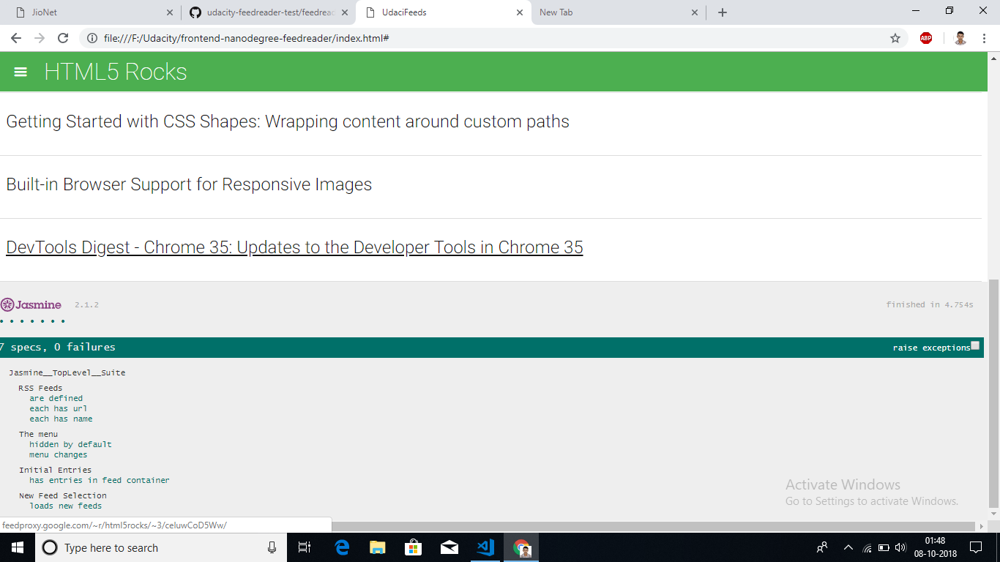

# steps required to successfully run the application.
1. Make sure Your connected to internet to run this project.
[. Downalod or clone the file form this link  ](https://github.com/Sbabureddy/frontend-nanodegree-feedreader.git)
1. Unzip it using winrar or 7zip application
1. Navigate to index.html and open it in your favourite browser.
1. Open feedreader.js file in your favourite editor to see the source code.
1. You will see the following out put.
1. 